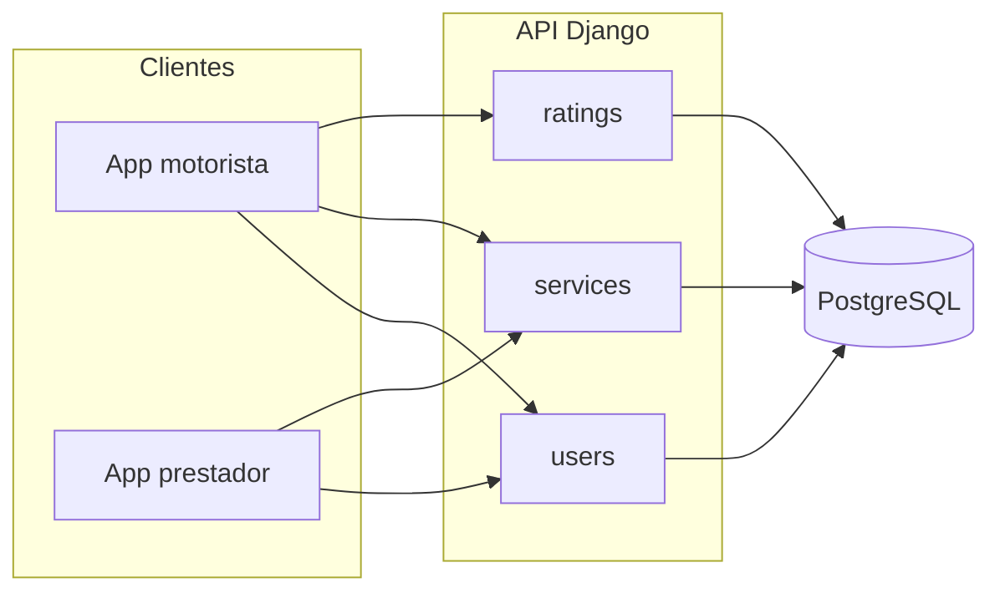

# ReboqueJá — Backend API

Plataforma de conexão entre **motoristas** e **prestadores de reboque**, com solicitações georreferenciadas, fluxo de status, avaliações e documentação OpenAPI.

**Desenvolvido por:** alunos do curso de Desenvolvimento Backend Python — **IFMG Betim** + **CEPEDI**.

---

## Sobre o projeto

Quando um veículo para na estrada, o motorista precisa de ajuda rápida e confiável. O ReboqueJá permite criar solicitações de reboque, matching por proximidade (Haversine), acompanhamento do atendimento e avaliação ao final.

## Tecnologias

| Camada | Tecnologia |
|--------|------------|
| Framework | Django 5+ |
| API | Django REST Framework |
| Auth | JWT (`djangorestframework-simplejwt`) |
| Banco | PostgreSQL (produção) / SQLite (dev) |
| Config | `django-environ` |
| Filtros | `django-filter` |
| Docs | `drf-spectacular` (OpenAPI 3) |
| Deploy | Gunicorn + WhiteNoise (`Procfile`) |

## Pré-requisitos

- Python 3.12+
- PostgreSQL (recomendado para ambiente igual à produção) ou apenas SQLite para testes rápidos
- `pip` e ambiente virtual

## Instalação local

```bash
git clone https://github.com/virgil-almeida/reboqueja-backend.git
cd reboqueja-backend

python -m venv .venv
source .venv/bin/activate   # Linux/macOS
# .venv\Scripts\activate    # Windows

pip install -r requirements.txt

cp .env.example .env
# Edite .env (SECRET_KEY, DATABASE_URL, etc.)

# Opcional: criar banco PostgreSQL
# createdb reboqueja

python manage.py migrate
python manage.py runserver
```

Servidor: `http://127.0.0.1:8000/`

## Variáveis de ambiente

Defina um arquivo `.env` no diretório do projeto (veja `.env.example`). O projeto usa **`django-environ`** em `config/settings.py`:

| Variável | Descrição |
|----------|-----------|
| `SECRET_KEY` | Chave secreta do Django (obrigatória) |
| `DEBUG` | `True`/`False` |
| `DATABASE_URL` | URL do banco (ex.: `postgres://...` ou `sqlite:///db.sqlite3`) |
| `ALLOWED_HOSTS` | Lista separada por vírgula (ex.: `localhost,127.0.0.1`) |

O arquivo `.env` **não** deve ser versionado; `.env.example` documenta as variáveis necessárias.

## Documentação da API (Swagger / OpenAPI)

| Ambiente | URL |
|----------|-----|
| **Local** | [Swagger UI](http://127.0.0.1:8000/api/docs/) · [ReDoc](http://127.0.0.1:8000/api/redoc/) · [Schema YAML](http://127.0.0.1:8000/api/schema/) |
| **Produção** | Substitua pelo seu domínio após o deploy, por exemplo: `https://<seu-app>.onrender.com/api/docs/` |

A integração usa **`drf-spectacular`**. O histórico do motorista documenta filtros de query (`status`, `data_inicio`, `data_fim`).

## Arquitetura (visão geral)



Apps Django:

- **`users`** — cadastro motorista/prestador, JWT, perfil, disponibilidade
- **`services`** — solicitações, matching, histórico, máquina de estados (`services/transitions.py`)
- **`ratings`** — avaliações após `concluido`

## Endpoints principais (v1)

Base: `http://127.0.0.1:8000/api/v1/`

| Método | Caminho | Autenticação | Descrição |
|--------|---------|--------------|-----------|
| `POST` | `/users/motoristas/` | Não | Cadastro motorista |
| `POST` | `/users/prestadores/` | Não | Cadastro prestador |
| `GET` | `/users/prestadores/<id>/` | Não | Perfil público do prestador (média de avaliações) |
| `POST` | `/auth/token/` | Não | Login (`email`, `password`) → `access` / `refresh` |
| `POST` | `/auth/token/refresh/` | Não | Renovar token |
| `GET`/`PATCH` | `/users/me/` | JWT | Perfil |
| `PATCH` | `/users/prestadores/disponibilidade/` | Prestador | `disponivel` |
| `POST` | `/services/solicitacoes/` | Motorista | Criar solicitação |
| `GET` | `/services/solicitacoes/<id>/` | Motorista | Detalhe + prestador após `aceito` |
| `GET` | `/services/solicitacoes/meu-historico/` | Motorista | Paginado; filtros `?status=&data_inicio=&data_fim=` (YYYY-MM-DD) |
| `GET` | `/services/solicitacoes/meus-atendimentos/` | Prestador | Histórico paginado |
| `GET` | `/services/solicitacoes/disponiveis/` | Prestador | `lat`, `lng`, `raio` |
| `POST` | `/services/solicitacoes/<id>/aceitar/` | Prestador | Aceitar |
| `POST` | `/services/solicitacoes/<id>/status/` | Prestador | `a_caminho` / `concluido` |
| `POST` | `/ratings/` | Motorista | Avaliar após `concluido` |

Header nas rotas protegidas: `Authorization: Bearer <access>`.

## Testes

### Pytest (fluxos principais + cobertura)

```bash
export SECRET_KEY="test-secret-key-for-local-pytest-only-32chars"
export DEBUG=True
export DATABASE_URL=sqlite:///test.sqlite3
export ALLOWED_HOSTS=localhost,127.0.0.1,testserver

pytest
```

Cobertura mínima configurada **60%** (`pytest.ini` + `.coveragerc`). Testes adicionais em `services/tests/` (Haversine e transições).

### Django test runner

```bash
python manage.py test services.tests
```

## CI (GitHub Actions)

No **push** e em **pull requests**, o workflow `.github/workflows/ci.yml` instala dependências e executa `pytest`.

## Deploy (Railway / Render)

- **PostgreSQL** provisionado no provedor; configure `DATABASE_URL`, `SECRET_KEY`, `DEBUG=False`, `ALLOWED_HOSTS` com o domínio público.
- **`Procfile`**: `release` roda migrações e `collectstatic`; `web` sobe o Gunicorn na porta `PORT`.
- **`runtime.txt`**: Python 3.12.
- Após o deploy, acesse **`/api/docs/`** na URL pública para validar o Swagger.

## Créditos

Projeto acadêmico — **IFMG Betim** em parceria com o **CEPEDI**.

---

*Metodologia: Scrum + Kanban*
